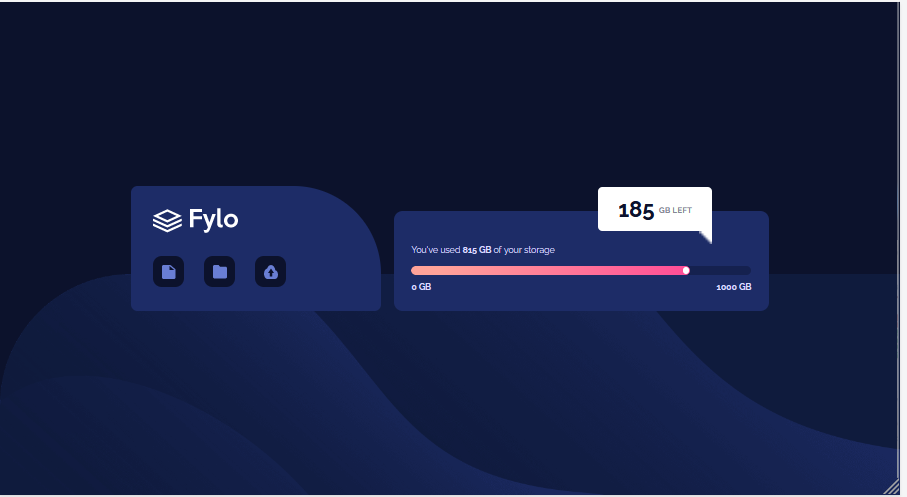
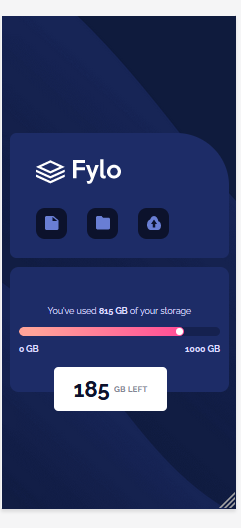

# Frontend Mentor - Fylo data storage component solution

This is a solution to the [Fylo data storage component challenge on Frontend Mentor](https://www.frontendmentor.io/challenges/fylo-data-storage-component-1dZPRbV5n). Frontend Mentor challenges help you improve your coding skills by building realistic projects. 

## Table of contents

- [Overview](#overview)
  - [The challenge](#the-challenge)
  - [Screenshot](#screenshot)
  - [Links](#links)
- [My process](#my-process)
  - [Built with](#built-with)
  - [What I learned](#what-i-learned)
  - [Continued development](#continued-development)
  - [Useful resources](#useful-resources)
- [Author](#author)
- [Acknowledgments](#acknowledgments)

## Overview
### The challenge

Users should be able to:

- View the optimal layout for the site depending on their device's screen size

### Screenshot

### 
Desktop view
 

### 
Mobile View
 

# 
### Links

- Solution URL : [Git URL](https://github.com/mathangisd/fylo-data-storage-component.git)

- Live URL : [Fylo Data Storage Component on Netlify](https://fylo-data-storage-msd.netlify.app/)

## My process
### Built with

- Semantic HTML5 markup
- CSS custom properties
- CSS Grid
- CSS Flexbox

### What I learned

This challenge involved some interesting aspects like progress indicator for storage data and making a message box with a triangle at the bottom. I also had to use absolute positioning  in a couple of places to position different elements.

### Continued-Development
I would like to work on projects with different layouts and focus on making them responsive.

### Useful resources

- [Create a custom-styled progress bar with Pure CSS and HTML](https://nikitahl.com/progress-bar-css) - Nikita Hlopov - This article gives good information on how to make cross browser friendly progress bar. This was useful in making the indicator for storage data.

- [Chat Bubbles in CSS](https://codepen.io/Founts/pen/AJyVOr) - Jason Founts - This codepen helped in getting the triangle flush to the bottom right of the message box.

## Author
- Website - [Mathangi Subramanian](https://github.com/mathangisd)
- Frontend Mentor - [mathangisd](https://www.frontendmentor.io/profile/mathangisd)

## Acknowledgments
Thank you to anyone for giving any feedback, it is always helpful to know how the code could be improved.